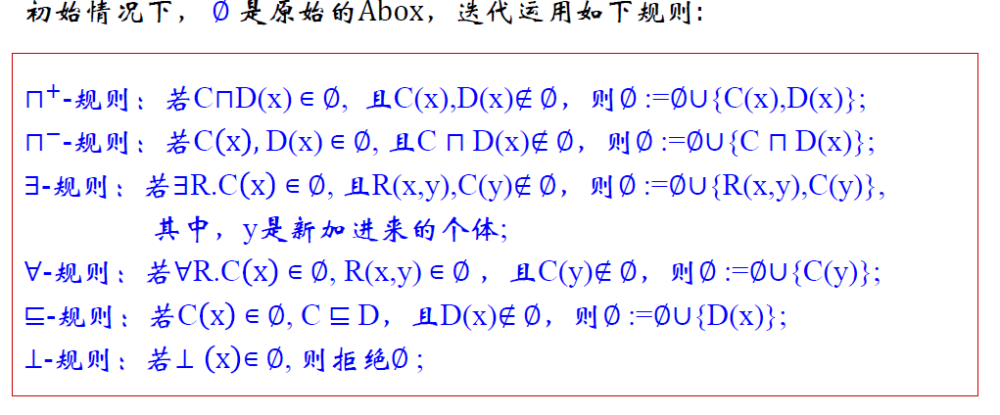

<!--
 * @Author: your name
 * @Date: 2020-06-25 09:18:13
 * @LastEditTime: 2020-06-25 09:52:05
 * @LastEditors: Please set LastEditors
 * @Description: In User Settings Edit
 * @FilePath: \Ten000hours.github.io\_posts\2020-06-25-logbook.md
--> 
  - [ ] 知识融合  
        需要融合多个数据库中的数据： dbpedia，关系性，网上的无结构数据。 
       
    
        
    

  - [ ] OWL 本体语言  

       最规范 最严谨 一阶谓词逻辑子集 
       
       

       

       

  

