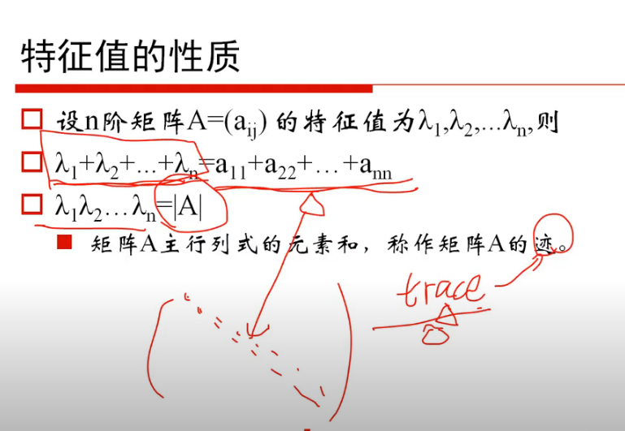
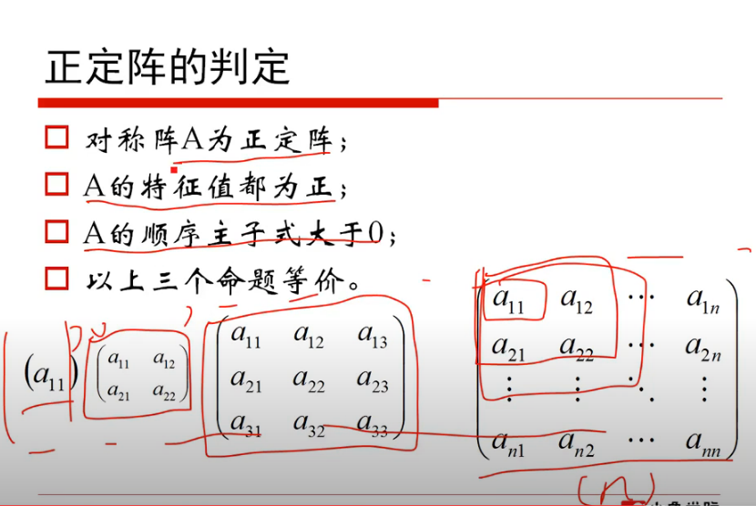
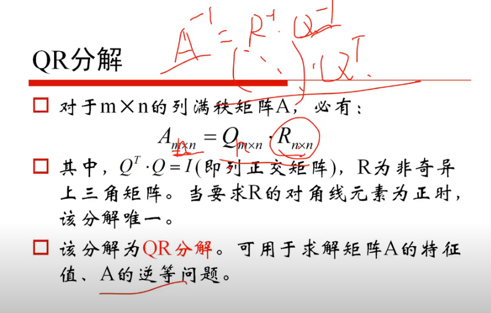

<!--
 * @Author: your name
 * @Date: 2020-06-25 09:18:13
 * @LastEditTime: 2020-06-26 10:06:50
 * @LastEditors: Please set LastEditors
 * @Description: In User Settings Edit
 * @FilePath: \Ten000hours.github.io\_posts\2020-06-25-logbook.md
--> 
  - [ ] 知识融合  
        需要融合多个数据库中的数据： dbpedia，关系性，网上的无结构数据。 
       
    

        
   

  - [ ] OWL 本体语言  

       最规范 最严谨 一阶谓词逻辑子集 
       
    

  -  [ ] 机器学习 

      数学基础 凸函数 小象学院 YouTube视频： 

      

      应用：SVD分解  

      行列式： 主对角线-次对角线 乘积
      
  特征值和特征向量：
  

  ### 实对称阵的特征向量是实数
    特征值不相等，特征向量是正交的

  ### 正定阵
  
  ###  QR分解
  
        
        

      

  

